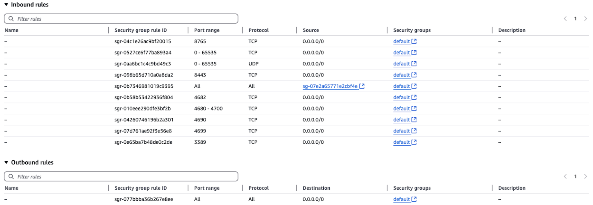

# OpenSpace WebRTC on AWS EC2

This guide explains how to set up OpenSpace WebRTC on an AWS EC2 instance with Windows. It covers installing dependencies, configuring the environment, and running the application in both secure and non-secure modes. Following this tutorial ensures that your EC2 instance is correctly configured for GPU-accelerated OpenSpace rendering.

---

## A. EC2 Machine Requirements
To run OpenSpace WebRTC smoothly in the cloud, we recommend using a GPU-enabled instance.  
- **Instance Type:** G4dn.xlarge with Tesla T4 GPU  
- **AWS Minimum Requirements:** See [OpenSpace WebRTC Cloud Requirements](instance-requirements.md)

> **Note:** Using the right instance ensures that multiple OpenSpace instances can run concurrently without performance degradation.

---

## B. Connecting to the EC2 Machine Remotely

OpenSpace WebRTC requires a Windows environment. You can connect to your EC2 instance using Remote Desktop.

### Windows: Using Remote Desktop
1. Log in to the [AWS EC2 Console](https://aws.amazon.com/free/?trk=bb2425c9-ff4c-4027-b10e-5b316df591d2&sc_channel=ps&ef_id=CjwKCAjwmenCBhA4EiwAtVjzmmzHt0MHnnQiOuQZskecD9CPEwmp-6fa8_-QQ6FUDY8gg5t0L9ZP1BoCbiEQAvD_BwE:G:s&s_kwcid=AL!4422!3!733753180498!p!!g!!aws%20console!22260922937!173945126103&gad_campaignid=22260922937&gbraid=0AAAAADjHtp8l_trh9bmT1Eel2hUp1Yb_m&gclid=CjwKCAjwmenCBhA4EiwAtVjzmmzHt0MHnnQiOuQZskecD9CPEwmp-6fa8_-QQ6FUDY8gg5t0L9ZP1BoCbiEQAvD_BwE&all-free-tier.sort-by=item.additionalFields.SortRank&all-free-tier.sort-order=asc&awsf.Free%20Tier%20Types=*all&awsf.Free%20Tier%20Categories=*all) as the root user.

2. Navigate to EC2 Dashboard → Select your Windows instance.

3. Retrieve the Administrator password:

      - Select the instance  → (Instance state → Start instance) → Connect → RDP Client tab → Get Password
      - Upload your `.pem` key and decrypt to get the Administrator password.

4. Open Remote Desktop Connection 
      - Press (`Win + R`), type `mstsc`, and hit `Enter`.
      - In the "Computer" field, enter the public IP/DNS.
      - Click `Connect`.
5. Login:

      - **Username:** Administrator  
      - **Password:** Use the one you just decrypted.
   
6. Trust Certificate: Accept the certificate warning and proceed.


### Mac: Using Microsoft Remote Desktop
1. Install Microsoft Remote Desktop: [Mac App Store](https://apps.apple.com/us/app/microsoft-remote-desktop/id1295203466)
2. Get EC2 Password: Follow the same steps on the AWS console as above to get the Administrator password.

3. Add a new PC in the Remote Desktop app:
      - Open Microsoft Remote Desktop.
      - Click `+` → Add PC.
      - Enter the public IP or DNS.
      - Use `Administrator` as the user and the decrypted password (or configure credentials under `User account`).

4. Connect:

      - Double-click the PC entry to initiate the session.
      - Accept certificate if prompted

> **Explanation:** Remote Desktop is required to manage the EC2 instance as if you were sitting in front of a physical Windows machine. This step is essential for installing software, configuring NVIDIA drivers, and running OpenSpace WebRTC.

---

## C. Enable Remote Procedure Call (RPC)
Windows uses RPC to allow different programs to communicate, including over the network.

1. Press `WIN + R` → type `services.msc` → hit `Enter`
2. Locate `Remote Procedure Call (RPC)`
3. Ensure the service is:

      - Running [Click on enable (if not enabled)]
      - Startup Type: Automatic


> **Explanation:** Enabling RPC ensures that Remote Desktop and other inter-process communication works reliably. 

> **Why do we need this:** Enabling Remote Procedure Call (RPC) on a Windows machine is essential because RPC is a core Windows service that allows processes and services to communicate across a network or within the same system. When you're remotely connecting to an EC2 Windows instance (or any Windows machine), RPC plays a foundational role in enabling Remote Desktop and other inter-process communication.

---

## D. Install Required Software
Install all of the following tools to ensure compatibility and productivity:

Developer Tools:

- Git Bash: https://git-scm.com/downloads  
- CMake >= 3.31: https://cmake.org/download/  
- VS Code: https://code.visualstudio.com/  
- Visual Studio (C++ Make Tools module): https://visualstudio.microsoft.com/  
- Python (latest stable): https://www.python.org/downloads/  
  *(Ensure "Add Python to PATH" is checked)*  
- Node.js: https://nodejs.org/en/download/  
- PostgreSQL >=13: https://www.postgresql.org/download/  
- DBeaver (GUI for PostgreSQL): https://dbeaver.io/download/  
- Qt 6.6.3 (MSVC build): https://www.qt.io/download-qt-installer

> **Explanation:** These dependencies are required to build, run, and maintain both the backend and frontend components of OpenSpace WebRTC on Windows.

---

## E. AWS CLI Setup (PowerShell)
AWS CLI allows you to manage your EC2 instance, S3 buckets, and other AWS services from PowerShell.

1. **Install AWS CLI**

      - Run in PowerShell:

         ```
         aws --version
         ```
      
      - If AWS CLI is not installed, then run:

         ```
         msiexec.exe /i https://awscli.amazonaws.com/AWSCLIV2.msi
         ```

      - Restart PowerShell.

2. **Configure AWS Credentials**

      - Run in PowerShell:

         ```
         aws configure
         ```

      - Input your credentials from the IAM Console (https://console.aws.amazon.com/iam/home#/security_credentials).
      - AWS Access Key ID [None]: YOUR_ACCESS_KEY
      - AWS Secret Access Key [None]: YOUR_SECRET_KEY
      - Default region name [None]: us-east-1
      - Default output format [None]: json

      - Verify by running this command: `Get-Content ~/.aws/credentials`


> **Explanation:** AWS CLI is used later for managing NVIDIA driver installation and automation tasks.

---

## F. Install NVIDIA Drivers

Use AWS-provided NVIDIA drivers for your GPU. Do not download from NVIDIA website. Reference [here](https://docs.aws.amazon.com/AWSEC2/latest/UserGuide/install-nvidia-driver.html).
```powershell
$Bucket = "ec2-windows-nvidia-drivers"
$KeyPrefix = "latest"
$LocalPath = "$home\Desktop\NVIDIA"
$Objects = Get-S3Object -BucketName $Bucket -KeyPrefix $KeyPrefix -Region us-east-1
foreach ($Object in $Objects) {
    $LocalFileName = $Object.Key
    if ($LocalFileName -ne '' -and $Object.Size -ne 0) {
        $LocalFilePath = Join-Path $LocalPath $LocalFileName
        Copy-S3Object -BucketName $Bucket -Key $Object.Key -LocalFile $LocalFilePath -Region us-east-1
    }
}
```
After a successful download, install the driver manually

> **Explanation:** Proper NVIDIA drivers are needed to run OpenGL and enable hardware-accelerated rendering for OpenSpace streaming.

---

## G. NVIDIA Control Panel Settings
To enable OpenGL, which is required to enable the OpenSpace streaming:

   - Right-click desktop → Open NVIDIA Control Panel.
   - Naviagte to Manage 3D Settings. Set the followings:

      - OpenGL Rendering GPU: NVIDIA RTX A10G
      - Power Management Mode: Prefer Maximum Performance

> **Explanation:** Ensures OpenSpace uses the GPU correctly for streaming and graphics.

---

## H. AWS Instance Configuration
### H1. Permanent IP (Elastic IP)

When you start or stop an AWS EC2 instance, its public IP address changes by default. To maintain a consistent IP address for accessing your instance, especially for applications, DNS configurations, or SSH connections, you need to associate an `Elastic IP`. This ensures your instance is always reachable at the same IP, even after reboots.

To set up a **permanent IP address** (Elastic IP) for your AWS EC2 instance, follow these steps:

1. Allocate an Elastic IP:

      1. Go to the EC2 Dashboard in the AWS Console.
      2. In the left sidebar, select Elastic IPs under Network & Security.
      3. Click Allocate Elastic IP address.
      4. Choose the scope (generally Amazon pool) and click Allocate.

2. Associate the Elastic IP with your EC2 Instance:

      1. After allocation, select the newly created Elastic IP.
      2. Click Actions → Associate Elastic IP address.
      3. In the Instance field, select your running EC2 instance.
      4. In the Private IP address field, choose the primary IP (usually the default one).
      5. Click Associate.

3. Update Security Groups (if needed):
      - Ensure your Security Group allows traffic (e.g., HTTP, HTTPS, SSH) for the new Elastic IP.

📌 **Important Notes:**

- Elastic IPs are static and remain with your instance until you detach them.
- If you stop and start the instance, the Elastic IP remains attached.
- AWS charges for unused Elastic IPs, so release it if you no longer need it.

> **Explanation:** Ensures the instance keeps a consistent IP even after restarts, which is required for users to reliably access OpenSpace.

### H2. Inbound Rules for Public Access

To make your application accessible from outside the AWS EC2 instance, you need to configure Inbound Rules in your instance's Security Group:

1. Navigate to Security Groups:

      1. Go to the EC2 Dashboard in the AWS Console.
      2. In the left sidebar, click Security Groups under Network & Security.
      3. Select the Security Group associated with your EC2 instance.

2. Configure Inbound Rules:

      1. Click on the Inbound rules tab.
      2. Click Edit inbound rules → Add rule.
      3. Add the necessary rules based on your application.
      
      

3. Save the Changes:
      - Click Save rules to apply the changes.

> **Explanation:** Without proper inbound rules, users cannot access OpenSpace from outside AWS.

---

### H3. Storage (EBS Volume)

OpenSpace WebRTC uses an **EBS volume** attached to the EC2 instance to store
binaries, assets, datasets, and runtime files.

### Volume Used

- **Size:** 100 GiB
- **Volume Type:** gp3
- **IOPS:** 3000
- **Throughput:** 125 MB/s
- **Availability Zone:** us-east-1f
- **Attached Device:** `/dev/sda1`
- **Instance:** GPU-enabled EC2 instance (e.g., `g4dn`)
- **State:** In-use
- **Encryption:** Not enabled (can be enabled if required)

The volume is created from a snapshot and attached automatically at launch.

### Notes

- Data persists across instance restarts
- Increase volume size if installing large datasets
- Create EBS snapshots before major changes

---

## I. Setup Multiple OpenSpace Instances
To set up multiple OpenSpace instances inside the AWS machine, do not forget to:

- Set OPENSPACE_SYNC folder (e.g., `c:\Users\..\OpenSpace\sync`)

- Run `add_rendering_instance.py`

- More details: [OpenSpace-Web-Backend](https://github.com/OpenSpace/OpenSpace-Web-Backend?tab=readme-ov-file#adding-an-openspace-instance-on-the-webrtc-rendering-server)

> **Explanation:** Multiple instances allow different users or sessions to run independently on the same EC2 machine.

---
## J. Running OpenSpace WebRTC

### 1. Secure Mode (EC2 Access)

1. Update API in `api.js`:

         export default openspaceApi(Environment.wsAddress, Environment.wsPort, true);

2. Enable secure section in `.env`at `/c/webrtc/UI-WebRTC/.env`. Uncomment the secure section, and comment the unsecure section.

3. Run proxy & Caddy servers:

      > ⚠️ **Important**
      >  
      > Caddy must be installed on the Windows machine **before** running the commands below.  
      > After installing Caddy, copy the `Caddyfile` from  `\webrtc\OpenSpace-Web-Backend\secure_deployment\Caddyfile` to `C:\Caddy\`.

            cd /c/webrtc/OpenSpace-Web-Backend/secure_deployment/
            python proxy.py

            cd /c/Caddy/
            ./caddy_windows_amd64.exe run

4. Start Supervisor (Web GUI + Signaling Server)
It will automatically start web-gui on 4690 and signaling server on port 8443

            cd /c/webrtc/OpenSpace-Web-Backend
            python supervisor.py

5. Start Backend Server

            cd /c/webrtc/Backend-WebRTC/
            npm start


6. Build Frontend UI Server

            cd /c/webrtc/UI-WebRTC/
            npm run build

7. Use the UI interface (https://openspaceweb.com) to start the OpenSpace instance by clicking the Join button.

      - Access the secure instance at `https://openspaceweb.com/frontend/#/streaming?id=0` from any machine or network.
      - *Just to test locally without using the interface, you can simply: Run `cd /c/webrtc/OpenSpace-Web-Backend/ && python start.py` to start the OpenSpace instance.*
      

> ⚠️ **Note on Domain Name**
>
> The URL `https://openspaceweb.com/` shown in these instructions was a domain purchased and used by the OpenSpace WebRTC project at the time of writing.  
> When deploying your own EC2 instance, you should replace this with a domain that you own.  
> In AWS, you can easily register or associate a domain with your EC2 instance using **Route 53**.  
> After updating your domain, make sure to also update the corresponding `Environment.js` configuration in the Frontend repository.  
> For reference, see how this was done in this commit: [update domain in Environment.js](https://github.com/OpenSpace/OpenSpace-WebGuiFrontend/commit/ddde0bc2bc8a05e50500c7f873926399f3d06988)

### 2. Non-Secure Mode (Local / Testing)

1. Update API in `api.js`:

         export default openspaceApi(Environment.wsAddress, Environment.wsPort, false);
      <!-- ``` -->

2. Enable unsecure section in `.env`at `/UI-WebRTC/.env`. Uncomment the unsecure section, and comment the secure section.

3. Start instance:

         cd /c/webrtc/OpenSpace-Web-Backend/testing
         python start.py
      <!-- ``` -->

4. Access via browser:

      - Local: `http://localhost:4690/frontend/#/streaming?id=0`

      - Other machines: add IP to `chrome://flags`

- More info → See [`local-single-machine.md`](../02-deployment-options/local-single-machine.md)

---
## Demo Video

To see OpenSpace WebRTC in action on an AWS EC2 instance, watch the following demo videos:

- **Non-secure connection** (inside the same machine, same network):  
  This demo shows the OpenSpace instance running on the EC2 Windows server and accessed locally within the same network.  
  <iframe width="560" height="315" src="https://www.youtube.com/embed/lCfv9l-rLxg?start=126&end=304" title="Non-secure OpenSpace WebRTC demo" frameborder="0" allowfullscreen></iframe>
   <!-- [](https://www.youtube.com/watch?v=lCfv9l-rLxg&start=0&end=304) -->

- **Secure connection** (Rendering server running on AWS instance, client accessing from outside the network):  
  This demo shows a secure deployment where the OpenSpace instance is hosted on EC2 and accessed remotely from a different network using HTTPS.  
  <iframe width="560" height="315" src="https://www.youtube.com/embed/lCfv9l-rLxg?start=441" title="Secure OpenSpace WebRTC demo" frameborder="0" allowfullscreen></iframe>
  <!-- [](https://www.youtube.com/watch?v=lCfv9l-rLxg&start=441) -->


---

## L. Additional Resources
- [OpenSpace-Web-Backend](https://github.com/OpenSpace/OpenSpace-Web-Backend/tree/aws)

- [Backend-WebRTC](https://github.com/OpenSpace/Backend-WebRTC)

- [UI-WebRTC](https://github.com/OpenSpace/UI-WebRTC/tree/secure)

---

## ⚠️ Known Issue (EC2 Deployment)
In some EC2 configurations, WebRTC video streaming may fail to render in the browser, even though user interaction and API communication remain functional. This is a known limitation and is left as future work.